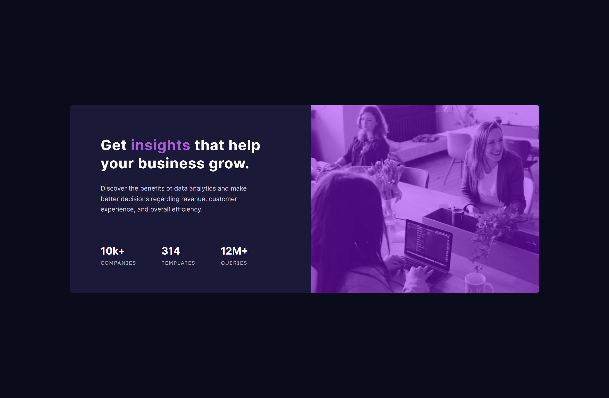
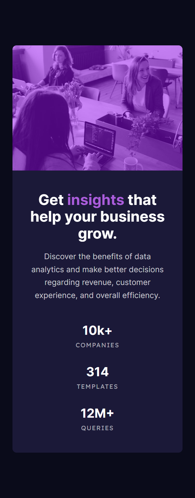

# Frontend Mentor - Stats preview card component solution

This is a solution to the [Stats preview card component challenge on Frontend Mentor](https://www.frontendmentor.io/challenges/stats-preview-card-component-8JqbgoU62). Frontend Mentor challenges help you improve your coding skills by building realistic projects.

## Table of contents

- [Frontend Mentor - Stats preview card component solution](#frontend-mentor---stats-preview-card-component-solution)
  - [Table of contents](#table-of-contents)
  - [Overview](#overview)
    - [The challenge](#the-challenge)
    - [Screenshot](#screenshot)
    - [Links](#links)
  - [Useful resources](#useful-resources)

## Overview

### The challenge

Users should be able to:

- View the optimal layout depending on their device's screen size

### Screenshot

| Desktop                                            | Mobile                                           |
| -------------------------------------------------- | ------------------------------------------------ |
|  |  |

### Links

- Solution URL: [frontendmentor.io](https://www.frontendmentor.io/solutions/stats-preview-card-component-uo2kXCTk1d)
- Live Site URL: [Github Page](https://kosmonavtsv.github.io/stats-preview-card-component-main)

## Useful resources

- [Custom properties with defaults: 3+1 strategies](https://lea.verou.me/blog/2021/10/custom-properties-with-defaults/)
